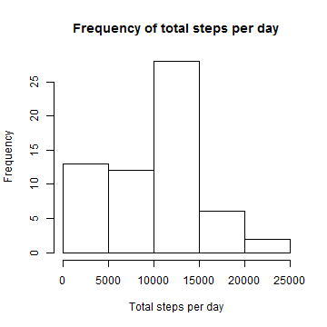
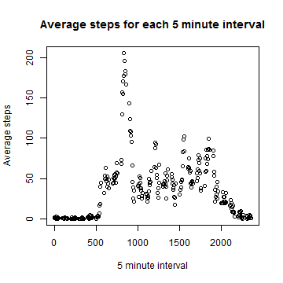
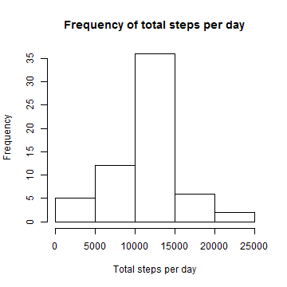
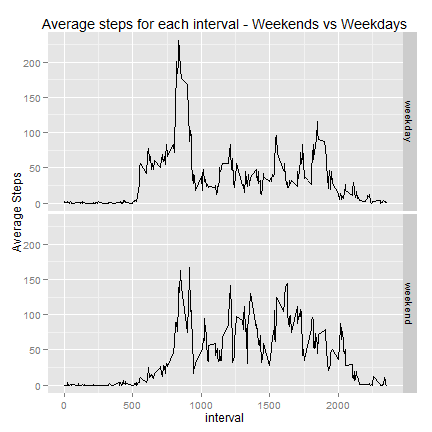

# Reproducible Research: Peer Assessment 1

## Loading and preprocessing the data

First, I will set my working directory to the location of the forked data. 


```r
dir<-"C:/Users/Maxsparrow/Documents/Data Scientist Specialization/Reproducible Research/Assignment 1/RepData_PeerAssessment1"
if(getwd()!=dir) {setwd(dir)}
```

Now I will unzip the data and load it into memory


```r
unzip("activity.zip")
data <- read.csv("activity.csv")
```

## What is mean total number of steps taken per day?

We want to make a histogram showing the total number of steps taken each day. In order to do this we first have to recast the data to show the total steps for each day. We will use reshape2 for this.


```r
library(reshape2)
recastdata <- recast(data,date ~ variable, sum,id.var="date",measure.var="steps",na.rm=TRUE)
```

Now we will make a histogram showing the total number of steps taken per day


```r
hist(recastdata$steps, main="Frequency of total steps per day", xlab = "Total steps per day")
```

 

Below, we find the mean and median of the total steps per day:

```r
print(mean(recastdata$steps))
```

```
## [1] 9354
```

```r
print(median(recastdata$steps))
```

```
## [1] 10395
```

## What is the average daily activity pattern?

Now we want to find the average number of steps taken, averaged across all days, for each 5-minute interval, so we will recast the original data again


```r
recastdata2<-recast(data,interval~variable,mean,id.var="interval",measure.var="steps",na.rm=TRUE)
```

Now we will plot the interval vs. average steps across days for each interval


```r
plot(recastdata2$interval,recastdata2$steps, main="Average steps for each 5 minute interval", xlab = "5 minute interval", ylab = "Average steps")
```

 

We need to find the interval that has the maximum number of average steps across all the days

```r
maxsteps<-max(recastdata2$steps)
print(subset(recastdata2,steps==maxsteps)$interval)
```

```
## [1] 835
```

## Imputing missing values

We will now work on resolving missing values. First, here are the total number of missing values:

```r
length(data[is.na(data)])
```

```
## [1] 2304
```

Now we need to impute the missing values. Since the average number of steps in each interval seemed to vary quite a bit, the interval values are important and we will use the average number of steps across all days for each interval to impute NAs. An alternative could be to use the average number of steps within that day, but this would be a problem because many days are missing all values, so you would need to use a different method for those values and it would become very complicated.

This will make a new data set that we can manipulate and impute new values for the NAs. For each value of steps in the data, we will check if it is NA. If it is, we will overwrite the value with the average steps across days for that interval from the earlier dataset we created for plotting.


```r
imputedata<-data
for(i in 1:nrow(imputedata)) {
    if(is.na(imputedata[i,1])) {
        imputedata[i,1]<-recastdata2[recastdata2[,1]==imputedata[i,3],]$steps
    }        
}
```

We need to show a histogram of the new imputed data for total number of steps per day. So we will recast it like we did previously.


```r
imputedatarec <- recast(imputedata,date ~ variable, sum,id.var="date",measure.var="steps",na.rm=TRUE)
hist(imputedatarec$steps, main="Frequency of total steps per day", xlab = "Total steps per day")
```

 

Also, here is the mean and median of the new imputed data for total number of steps per day, like we did previously.


```r
print(mean(imputedatarec$steps))
```

```
## [1] 10766
```

```r
print(median(imputedatarec$steps))
```

```
## [1] 10766
```

It's notable that the mean and median are the same, but not that surprising. Since my method of imputing NAs is quite simple, many days that were full of NAs have all the same values, since we were imputing based on the averages of the intervalsacross all days, and not imputing differently for different days. Since many days have all the same values, it's conceivable that the mean and the median would be the same.

Also the mean and median of total steps went up a fair amount compared to the original dataset. This is mostly due to the fact that, with so many NAs, there were many days with very few or 0 total steps. Now with everything being closer to the average, there are more days with 10-15 thousand total steps, as shown in the histogram.

## Are there differences in activity patterns between weekdays and weekends?

We need to make a graph comparing weekend and weekday vlues for steps taken for each interval. First we will convert the data that has imputed NAs so that the date is in date format, then add a factor for weekend and weekday days.


```r
imputedata$date<-as.Date(imputedata$date)
imputedata$weekend<-as.factor(ifelse(weekdays(imputedata$date) %in% c("Saturday","Sunday"),"weekend","weekday"))
```

Now we will recast the data so that we can measure the average steps across all days for each interval with two factors - weekday and weekend.


```r
imputedatarec2 <- recast(imputedata,interval + weekend ~ variable, mean,measure.var="steps")
```

We'll use ggplot to create a weekday vs weekend plot of the average steps across days for each interval.


```r
library(ggplot2)
```

```
## Warning: package 'ggplot2' was built under R version 3.1.1
```

```r
g<-ggplot(imputedatarec2,aes(interval,steps)) +
    geom_line() +
    facet_grid(weekend~.) +
    labs(title="Average steps for each interval - Weekends vs Weekdays",y="Average Steps")
print(g)
```

 
    
